---
## Front matter
lang: ru-RU
title: Лабораторная работа №1
author: |
	Великоднева Евгения
institute: |
	\inst{}RUDN University, Moscow, Russian Federation
date: 13 июня, 2022

## Formatting
toc: false
slide_level: 2
theme: metropolis
header-includes: 
 - \metroset{progressbar=frametitle,sectionpage=progressbar,numbering=fraction}
 - '\makeatletter'
 - '\beamer@ignorenonframefalse'
 - '\makeatother'
aspectratio: 43
section-titles: true
---

## Цель работы

Целью данной работы является приобретение практических навыков установки операционной системы на виртуальную машину, настройки минимально необходимых для дальнейшей работы сервисов.

# Выполнение лабораторной работы

# 1. Загрузила VirtualBox и запустила её на своём ПК. Создала новую виртуальную машину. 
## 2. Указала имя виртуальной машины(мой логин в дисплейном классе) и тип операционной системы - Linux,Fedora. (рис. [-@fig:001])

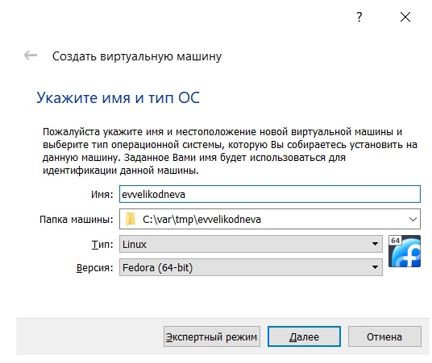{ #fig:001 width=70% }

## 3. Указала размер основной памяти виртуальной машины — 4096 МБ.(рис. [-@fig:002])

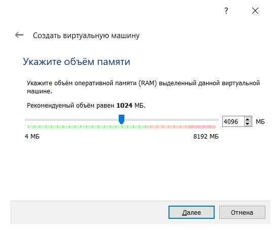{ #fig:002 width=70% }

## 4. Создала новый виртуальный жёсткий диск.(рис. [-@fig:003])

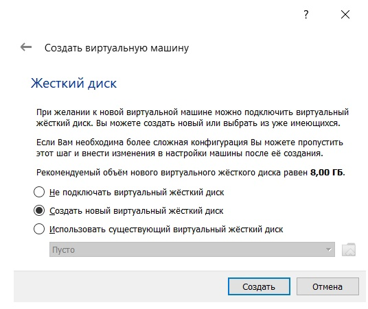{ #fig:003 width=70% }

## 5. Указала тип файла vdi.(рис. [-@fig:004])

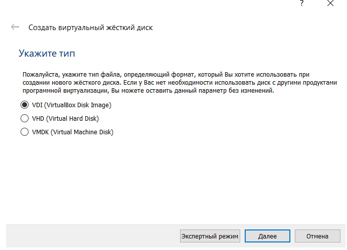{ #fig:004 width=70% }

## 6. Указала динамический формат хранения.(рис. [-@fig:005])

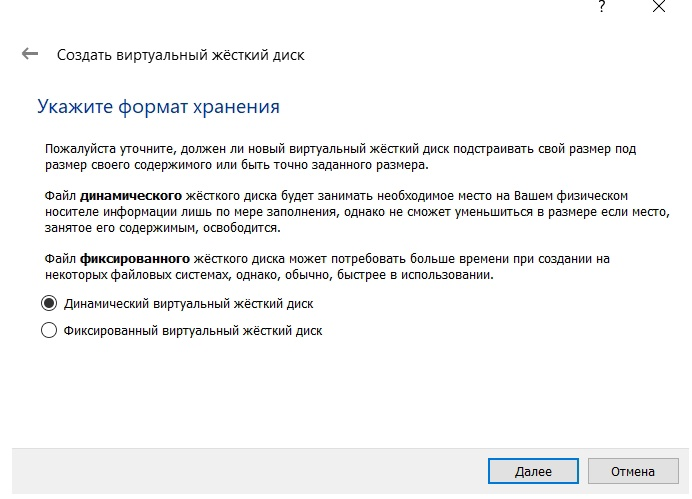{ #fig:005 width=70% }

## 7. Указала имя файла и размер 80 ГБ.(рис. [-@fig:006])

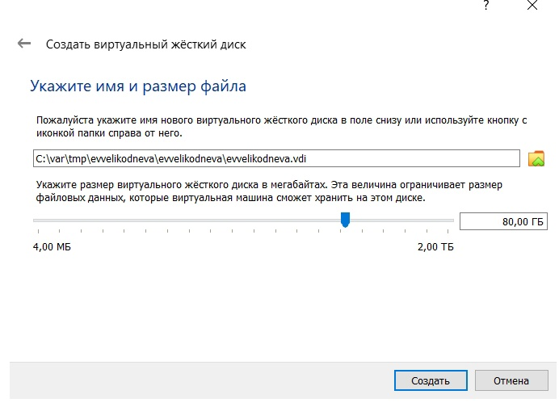{ #fig:006 width=70% }

## 8. Добавила новый привод оптических дисков, выбрала скачанный образ операционной системы Fedora.(рис. [-@fig:007])

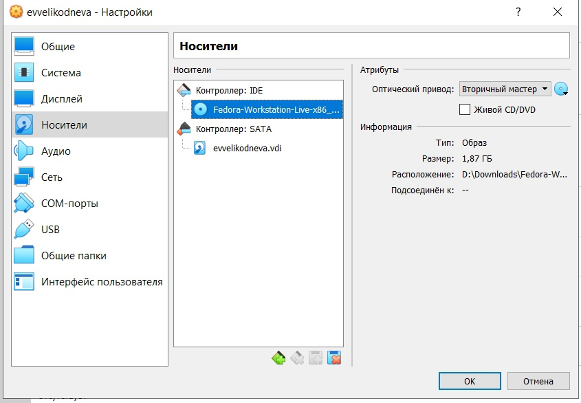{ #fig:007 width=70% }

# 9. Запустила виртуальную машину, выбрала русский язык интерфейса и перешла к настройкам установки операционной системы. Не меняла настройки по умолчанию.

# 10. После завершения установки отключила оптический диск и снова запустила виртуальную машину. 

# Выполнение домашнего задания

## Открыла терминал, посмотрела вывод команды dmesg | less. (рис. [-@fig:008])

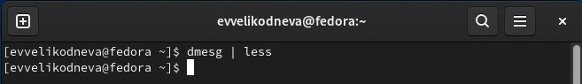{ #fig:008 width=70% }

# Нашла информацию о:

## 1. Версии ядра Linux (рис. [-@fig:009])

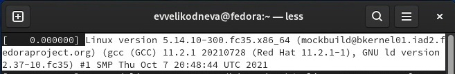{ #fig:009 width=70% }

## 2. Частоте процессора (рис. [-@fig:010])

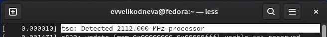{ #fig:010 width=70% }

## 3. Модели процессора (рис. [-@fig:011])

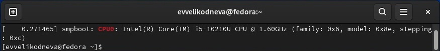{ #fig:011 width=70% }

## 4. Объёме доступной оперативной памяти (рис. [-@fig:012])

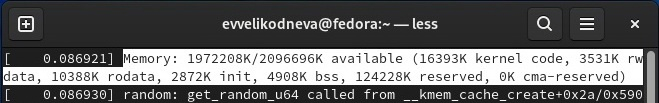{ #fig:012 width=70% }

## 5. Типе обнаруженного гипервизора (рис. [-@fig:013])

{ #fig:013 width=70% }

## 6. Типе файловой системы (рис. [-@fig:014])

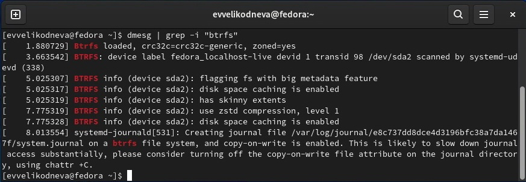{ #fig:014 width=70% }

## 7. Последовательности монтирования файловых систем (рис. [-@fig:015])

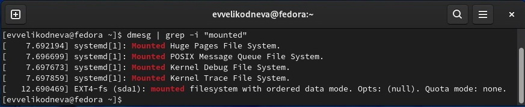{ #fig:015 width=70% }

## Выводы

Приобрела практические навыки установки операционной системы на виртуальную машину, настройки минимально необходимых для дальнейшей работы сервисов.
