---
## Front matter
title: "Отчёт по лабораторной работе №1"
author: "Великоднева Евгения"

## Generic otions
lang: ru-RU
toc-title: "Содержание"

## Bibliography
bibliography: bib/cite.bib
csl: pandoc/csl/gost-r-7-0-5-2008-numeric.csl

## Pdf output format
toc: true # Table of contents
toc-depth: 2
lof: true # List of figures
lot: true # List of tables
fontsize: 12pt
linestretch: 1.5
papersize: a4
documentclass: scrreprt
## I18n polyglossia
polyglossia-lang:
  name: russian
  options:
	- spelling=modern
	- babelshorthands=true
polyglossia-otherlangs:
  name: english
## I18n babel
babel-lang: russian
babel-otherlangs: english
## Fonts
mainfont: PT Serif
romanfont: PT Serif
sansfont: PT Sans
monofont: PT Mono
mainfontoptions: Ligatures=TeX
romanfontoptions: Ligatures=TeX
sansfontoptions: Ligatures=TeX,Scale=MatchLowercase
monofontoptions: Scale=MatchLowercase,Scale=0.9
## Biblatex
biblatex: true
biblio-style: "gost-numeric"
biblatexoptions:
  - parentracker=true
  - backend=biber
  - hyperref=auto
  - language=auto
  - autolang=other*
  - citestyle=gost-numeric
## Pandoc-crossref LaTeX customization
figureTitle: "Рис."
tableTitle: "Таблица"
listingTitle: "Листинг"
lofTitle: "Список иллюстраций"
lotTitle: "Список таблиц"
lolTitle: "Листинги"
## Misc options
indent: true
header-includes:
  - \usepackage{indentfirst}
  - \usepackage{float} # keep figures where there are in the text
  - \floatplacement{figure}{H} # keep figures where there are in the text
---

# Цель работы

Целью данной работы является приобретение практических навыков установки операционной системы на виртуальную машину, настройки минимально необходимых для дальнейшей работы сервисов.

# Задание

Создайте новую виртуальную машину.
Укажите имя виртуальной машины (ваш логин в дисплейном классе), тип операцион-
ной системы — Linux, Fedora.
Укажите размер основной памяти виртуальной машины — от 2048 МБ.
Задайте конфигурацию жёсткого диска — загрузочный, VDI (BirtualBox Disk Image),
динамический виртуальный диск.
Задайте размер диска — 80 ГБ (или больше), его расположение — в данном случае
/var/tmp/имя_пользователя/fedora.vdi.
Выберите в VirtualBox Свойства Носители Вашей виртуальной машины. Добавьте новый
привод оптических дисков и выберите образ afs dk.sci.pfu.edu.ru common files
iso Fedora-Workstation-Live-x86_64-35-1.2.iso .
При установке на собственной технике используйте скачанный образ операционной
системы Fedora.
Запустите виртуальную машину, выберите язык интерфейса и перейдите к настройкам
установки операционной системы.
При необходимости скорректируйте часовой пояс, раскладку клавиатуры (рекоменду-
ется в качестве языка по умолчанию указать английский язык).
Место установки ОС оставьте без изменения.
После завершения установки операционной системы корректно перезапустите вирту-
альную машину.
Установите имя и пароль для пользователя
В VirtualBox оптический диск должен отключиться автоматически, но если это не
произошло, то необходимо отключить носитель информации с образом, выбрав Свойства
Носители
Fedora-Workstation-Live-x86_64-35-1.2.iso
Удалить устройство .
Войдите в ОС под заданной вами при установке учётной записью. В меню Устройства
виртуальной машины подключите образ диска дополнений гостевой ОС, при
необходимости введите пароль пользователя root вашей виртуальной ОС.
После загрузки дополнений нажмите Return или Enter и корректно переза-
грузите виртуальную машину.

# Домашнее задание

Дождитесь загрузки графического окружения и откройте терминал. В окне термина-
ла проанализируйте последовательность загрузки системы, выполнив команду dmesg.
Можно просто просмотреть вывод этой команды:
dmesg | less
Можно использовать поиск с помощью grep:
dmesg | grep -i "то, что ищем"

Получите следующую информацию.
1.Версия ядра Linux (Linux version).
2.Частота процессора (Detected Mhz processor).
3.Модель процессора (CPU0).
4.Объем доступной оперативной памяти (Memory available).
5.Тип обнаруженного гипервизора (Hypervisor detected).
6.Тип файловой системы корневого раздела.
7.Последовательность монтирования файловых систем.

# Теоретическое введение

Лабораторная работа подразумевает установку на виртуальную машину VirtualBox
(https://www.virtualbox.org/) операционной системы Linux (дистрибутив Fedora).
Выполнение работы возможно как в дисплейном классе факультета физико-
математических и естественных наук РУДН, так и дома. Описание выполнения работы
приведено для дисплейного класса со следующими характеристиками техники:
– Intel Core i3-550 3.2 GHz, 4 GB оперативной памяти, 8 GB свободного места на жёстком
диске;
– ОС Linux Gentoo (http://www.gentoo.ru/);
– VirtualBox версии 6.1 или новее.
Для установки в виртуальную машину используется дистрибутив Linux Fedora-35
(https://getfedora.org/ru/workstation/download/).
При выполнении лабораторной работы на своей технике вам необходимо скачать
необходимый образ операционной системы.
Команда dmesg показывает сообщения от ядра и от системных служб.

# Выполнение лабораторной работы

1. Загрузила VirtualBox и запустила её на своём ПК. Создала новую виртуальную машину. 

2. Указала имя виртуальной машины(мой логин в дисплейном классе) и тип операционной системы - Linux,Fedora. (рис. [-@fig:001])

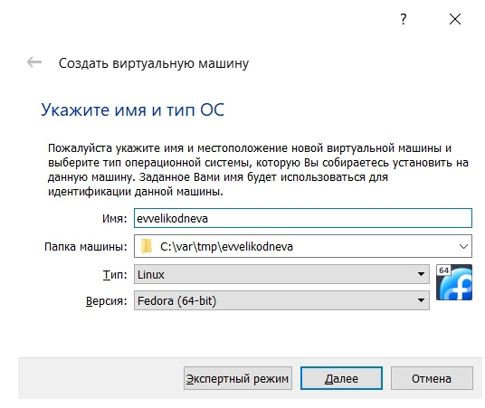{ #fig:001 width=70% }

3. Указала размер основной памяти виртуальной машины — 4096 МБ.(рис. [-@fig:002])

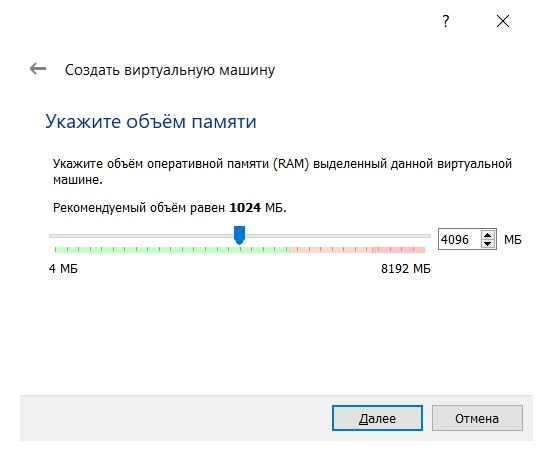{ #fig:002 width=70% }

4. Создала новый виртуальный жёсткий диск.(рис. [-@fig:003])

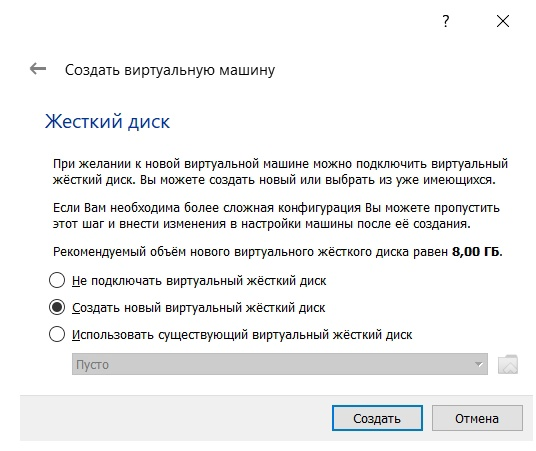{ #fig:003 width=70% }

5. Указала тип файла vdi.(рис. [-@fig:004])

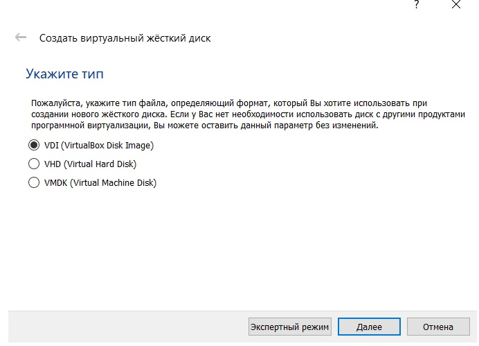{ #fig:004 width=70% }

6. Указала динамический формат хранения.(рис. [-@fig:005])

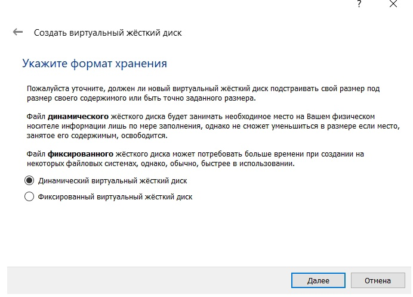{ #fig:005 width=70% }

7. Указала имя файла и размер 80 ГБ.(рис. [-@fig:006])

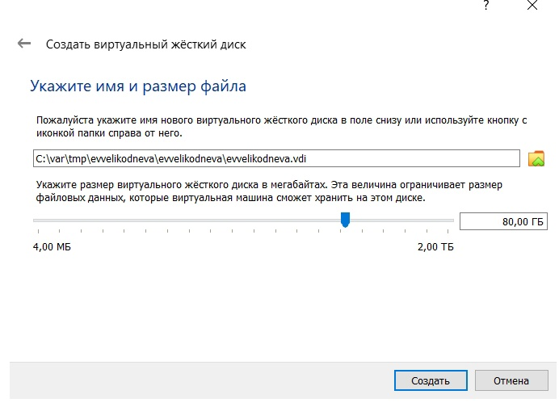{ #fig:006 width=70% }

8. Добавила новый привод оптических дисков, выбрала скачанный образ операционной системы Fedora.(рис. [-@fig:007])

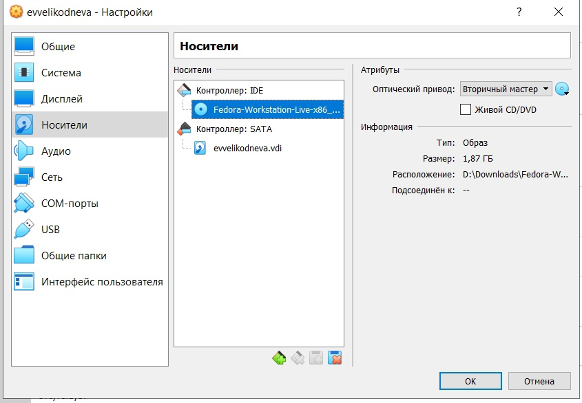{ #fig:007 width=70% }

9. Запустила виртуальную машину, выбрала русский язык интерфейса и перешла к настройкам установки операционной системы. Не меняла настройки по умолчанию.

10. После завершения установки отключила оптический диск и снова запустила виртуальную машину. 

# Выполнение домашнего задания

Открыла терминал, посмотрела вывод команды dmesg | less. (рис. [-@fig:008])

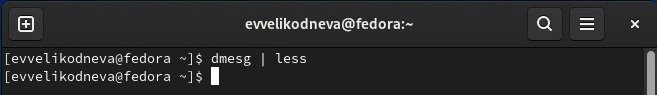{ #fig:008 width=70% }

Нашла информацию о:

1. Версии ядра Linux (рис. [-@fig:009])

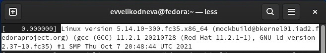{ #fig:009 width=70% }

2. Частоте процессора (рис. [-@fig:010])

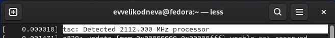{ #fig:010 width=70% }

3. Модели процессора (рис. [-@fig:011])

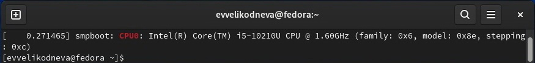{ #fig:011 width=70% }

4. Объёме доступной оперативной памяти (рис. [-@fig:012])

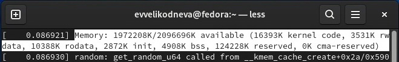{ #fig:012 width=70% }

5. Типе обнаруженного гипервизора (рис. [-@fig:013])

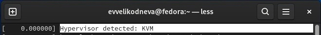{ #fig:013 width=70% }

6. Типе файловой системы (рис. [-@fig:014])

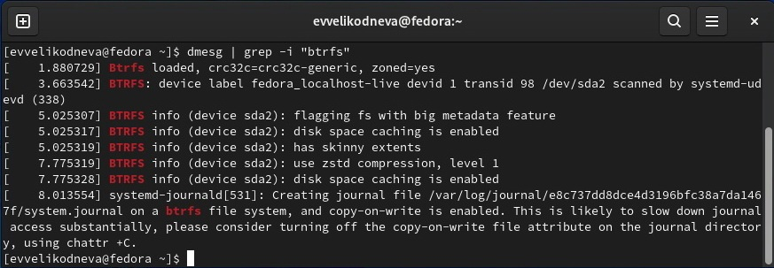{ #fig:014 width=70% }

7. Последовательности монтирования файловых систем (рис. [-@fig:015])

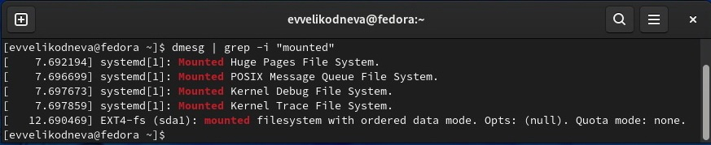{ #fig:015 width=70% }

# Контрольные вопросы

1. Идентификатор пользователя (login) и его пароль.
2. 
-man
-cd
-ls
-du
-mkdir, touch,rm,rmdir
-chmod
-history
3. Файловая система – это инструмент, позволяющий операционной системе и программам обращаться к нужным файлам и работать с ними. При этом программы оперируют только названием файла, его размером и датой созданий. Все остальные функции по поиску необходимого файла в хранилище и работе с ним берет на себя файловая система накопителя.

FAT — классическая архитектура файловой системы. Существует четыре версии FAT — FAT12, FAT16, FAT32 и exFAT (FAT64). Они отличаются разрядностью записей в дисковой структуре, то есть количеством бит, отведённых для хранения номера кластера. Изначально FAT не поддерживала иерархическую систему каталогов — все файлы располагались в корне диска. Это было сделано для упрощения, так как на односторонних дискетах ёмкостью всего 160–180 Кбайт сортировать немногочисленные файлы по каталогам попросту не было смысла. С распространением дискет на 320 и более килобайт хранение всех файлов в корне оказалось неудобным, к тому же малый размер корневого каталога ограничивал количество файлов на диске. Каталоги были введены с выходом MS-DOS 2.0.

Network File System (NFS) — протокол сетевого доступа к файловым системам, первоначально разработан Sun Microsystems в 1984 году. За основу взят протокол вызова удалённых процедур. Позволяет монтировать (подключать) удалённые файловые системы через сеть.

AEFS — шифрующая виртуальная файловая система для операционных систем класса OS/2 или UNIX. Поддерживает популярные криптостойкие алгоритмы шифрования AES и Twofish с ключом до 256 бит включительно.

4. Информация о файловых системах и точках монтирования находится в файле /etc/fstab.

5. С помощью команды kill и PID.

# Выводы

Приобрела практические навыки установки операционной системы на виртуальную машину, настройки минимально необходимых для дальнейшей работы сервисов.

