---
## Front matter
lang: ru-RU
title: Лабораторная работа №2
author: |
	Великоднева
institute: |
	\inst{}RUDN University, Moscow, Russian Federation
date: 13 июня, 2022

## Formatting
toc: false
slide_level: 2
theme: metropolis
header-includes: 
 - \metroset{progressbar=frametitle,sectionpage=progressbar,numbering=fraction}
 - '\makeatletter'
 - '\beamer@ignorenonframefalse'
 - '\makeatother'
aspectratio: 43
section-titles: true
---

## Цель работы

– Изучить идеологию и применение средств контроля версий.
– Освоить умения по работе с git.

# Выполнение лабораторной работы

# 1. Создала учётную запись на https://github.com и заполнила основные данные.

## 2. Перешла в каталог /tmp с помощью команды cd и установила необходимое программное обеспечение. (рис. [-@fig:001])

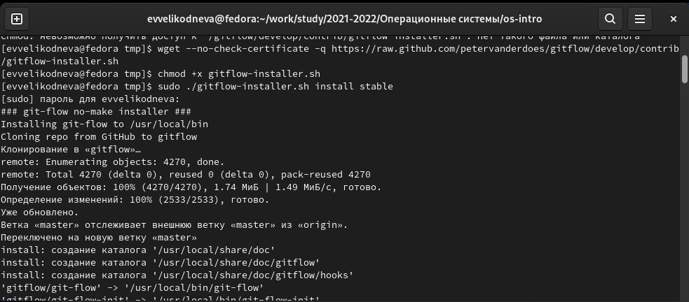{ #fig:001 width=70% }

## 3. Установила gh с помощью команды dnf install. (рис. [-@fig:002])

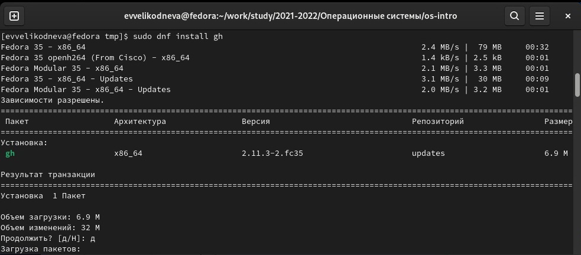{ #fig:002 width=70% }

## 4. Задала имя и email владельца репозитория. (рис. [-@fig:003])

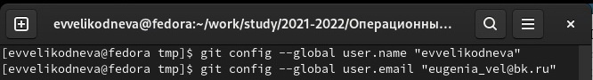{ #fig:003 width=70% }

## 5. Настроила utf-8 в выводе сообщений git. (рис. [-@fig:004])

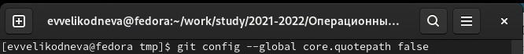{ #fig:004 width=70% }

## 6. Настроила верификацию и подписание коммитов git, задала имя начальной ветки master. (рис. [-@fig:005])

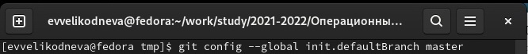{ #fig:005 width=70% }

## 7. Настроила параметр autocrlf. (рис. [-@fig:006])

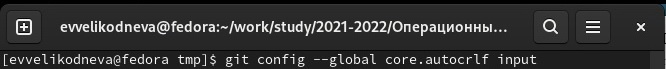{ #fig:006 width=70% }

## 8. Настроила параметр safecrlf. (рис. [-@fig:007])

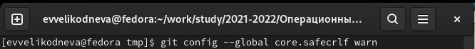{ #fig:007 width=70% }

## 9. Создала ssh ключ по алгоритму rsa. (рис. [-@fig:008])

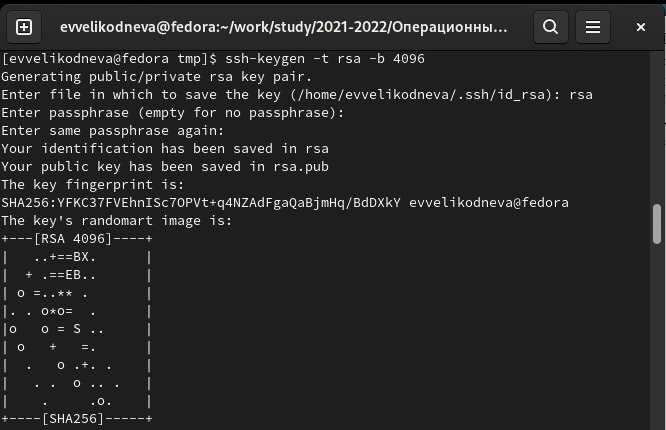{ #fig:008 width=70% }

## 10. Создала ssh ключ по алгоритму ed25519. (рис. [-@fig:009])

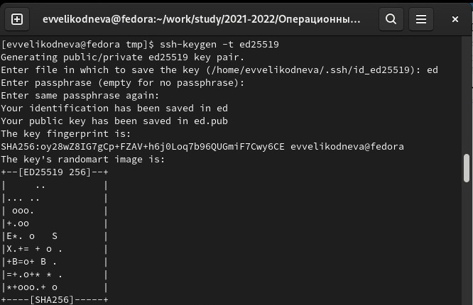{ #fig:009 width=70% }

## 11. Сгенерировала ключ. (рис. [-@fig:010])

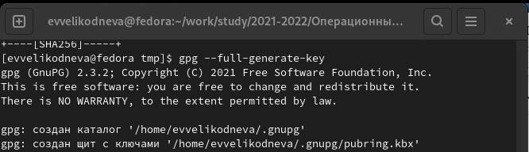{ #fig:010 width=70% }

## 12. Выбрала тип ключа RSA and RSA, задала размер 4096, выбрала срок действия по умолчанию. Ввела запрашиваемую информацию: имя, адрес электронной почты, примечание оставила пустым. (рис. [-@fig:011]) 

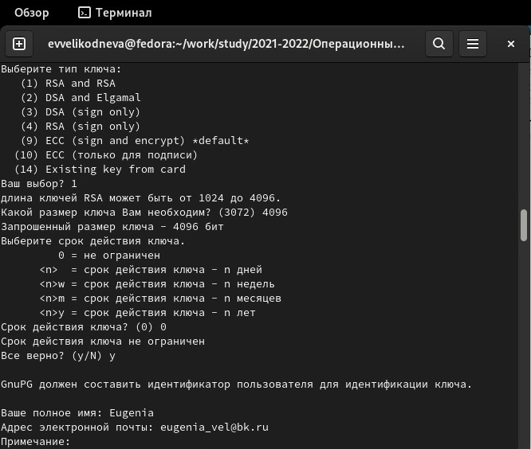{ #fig:011 width=70% }

## Мне предложили поменять данные, которые я ввела, но так как всё было правильно, я ничего больше не меняла. (рис. [-@fig:012])

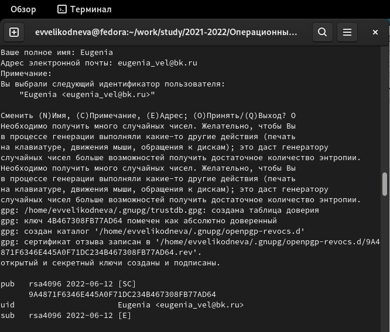{ #fig:012 width=70% }

## 13. Вывела список ключей и скопировала отпечаток приватного ключа. (рис. [-@fig:013])

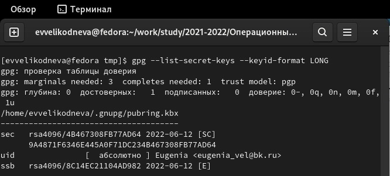{ #fig:013 width=70% }

## 14. Скопировала сгенерированный PGP ключ в буфер обмена, перешла в настройки GitHub и добавила новый PGP ключ. (рис. [-@fig:014])

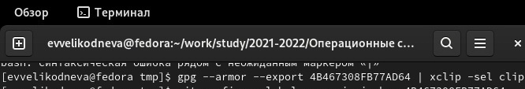{ #fig:014 width=70% }

## 15. Используя введёный email, указала Git применять его при подписи коммитов. (рис. [-@fig:015])

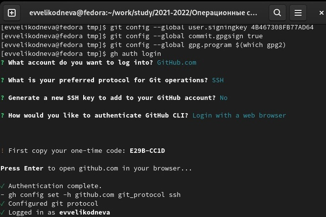{ #fig:015 width=70% }

# 16. Авторизовалась в gh. (рис. [-@fig:015])

## 17. Клонировала шаблон репозитория к себе в gh, а затем скопировала его к себе в систему. (рис. [-@fig:016])

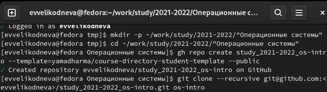{ #fig:016 width=70% }

## 18. Перешла в каталог курса с помощью команды cd. (рис. [-@fig:017])

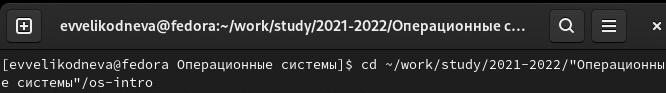{ #fig:017 width=70% }

## 19. Удалила лишние файлы с помощью команды rm. (рис. [-@fig:018])

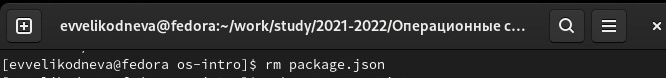{ #fig:018 width=70% }

## 20. Создала необходимые каталоги с помощью команды make. (рис. [-@fig:019])

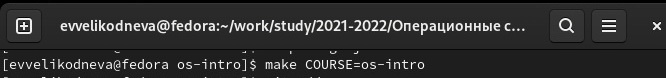{ #fig:019 width=70% }

## 21. Отправила файлы на сервер с помощью команд git add, git commit и git push. (рис. [-@fig:020])

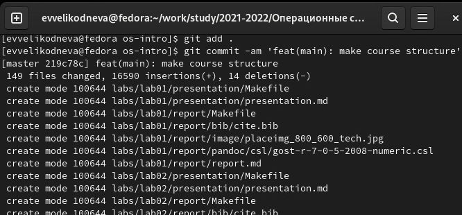{ #fig:020 width=70% }

## Выводы

Изучила идеологию и применение средств контроля версий, освоила умения по работе с git. 
